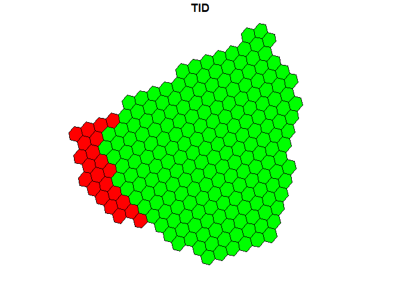

Tutorial Overview
-----------------

This tutorial demonstrates some simple spatial overlay analysis of
polygon data using the `IDEAS` data model, as described in [Robertson et
al. 2020.](https://www.sciencedirect.com/science/article/pii/S0924271620300502)

Preliminaries
-------------

We will load some sample data from the `stampr` package, and pull out
two polygons to demonstrate overlay operations.

``` r
library(stampr)
library(sp)
data(mpb)
P1 <- subset(mpb, TGROUP==1)[5,]
P2 <- subset(mpb, TGROUP==2)[7,]
plot(P2, border="green")
plot(P1, add=TRUE, border="blue")
```


First we need to load some libraries;

``` r
library("dplyr")
library("dbplyr")
library("DBI")
library("leaflet")
library("sf")
library("RODBC")
library("nzdggs")
```

Loading Polygon Data from IDEAS
-------------------------------

We will use the `con` data connection to access a table called `mpb`
which has the same data from the `stampr` package in `IDEAS` format.

``` r
mpb.i <- tbl(con,"MPB")
grid <- tbl(con,"FINALGRID2") %>% filter(RESOLUTION==19)
head(mpb.i)
#> # Source:   lazy query [?? x 4]
#> # Database: NetezzaConnection
#>        DGGID VALUE KEY        TID
#>        <dbl> <int> <chr>    <int>
#> 1 4921587640     1 BOUNDARY  1264
#> 2 4921646690     1 BOUNDARY  1264
#> 3 4921587640     0 ID        1264
#> 4 4921646690     0 ID        1264
#> 5 4921587640  1264 tid       1264
#> 6 4921646690  1264 tid       1264
```

We want to pull out those same two polygons by identifying them by their
ID values, as follows:

``` r
ID1 <- P1$ID
ID2 <- P2$ID
 
P1.i <- mpb.i %>% filter(KEY=="ID") %>% filter(VALUE==ID1) %>% inner_join(., grid, "DGGID") %>% mutate(WKT=inza..ST_AsText(GEOM)) %>% collect()
P2.i <- mpb.i %>% filter(KEY=="ID") %>% filter(VALUE==ID2) %>% inner_join(., grid, "DGGID") %>% mutate(WKT=inza..ST_AsText(GEOM)) %>% collect() 

dbDisconnect(con)

plot(st_as_sf(P2.i, wkt='WKT', crs = 4326)['TID'], col='green', reset=FALSE)
plot(st_as_sf(P1.i, wkt='WKT', crs = 4326)['TID'], add=TRUE, col='blue')
```


Overlay Analysis using `IDEAS` data model
-----------------------------------------

### Intersection

``` r

intersection <- P1.i %>% inner_join(., P2.i, "DGGID")
plot(st_as_sf(P2.i, wkt='WKT', crs = 4326)['TID'], col='green', reset=FALSE)
plot(st_as_sf(P1.i, wkt='WKT', crs = 4326)['TID'], add=TRUE, col='blue')
plot(st_as_sf(intersection, wkt='WKT.x', crs = 4326)['TID.x'], add=TRUE, col='red')
```


### Union

``` r
union <- union_all(P1.i, P2.i) %>% distinct(DGGID, .keep_all = TRUE)
plot(st_as_sf(union, wkt=c('WKT'), crs = 4326)['TID'], col='red')
```


### A NOT B

``` r
ANotB <- P1.i %>% anti_join(., P2.i, "DGGID")
plot(st_as_sf(P2.i, wkt='WKT', crs = 4326)['TID'], col='green', reset=FALSE)
plot(st_as_sf(ANotB, wkt=c('WKT'), crs = 4326)['TID'], add=TRUE, col='red')
```


